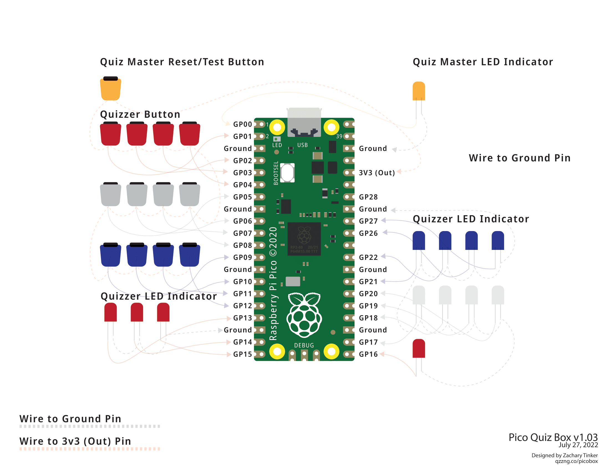

# Pico-Quiz-Box

The Pico Quiz Box project was developed by qzzng co-op as a way to enable more people to engage with Bible quizzing no matter the group, denomination, or quizzing style. The Pico Quiz Box can be configured to accept hand buzzers (as outlined in the build guide on the wiki), benches, or pads. A full set of build instructions as well as a list of people who can help you build a box are listed on the Wiki. 

If you have any questions, please do not hesistate to reach out. You can contact me at zachary@qzzng.co

## Raspberry Pi Pico Quiz Box Pinout

## Finite State Machine

